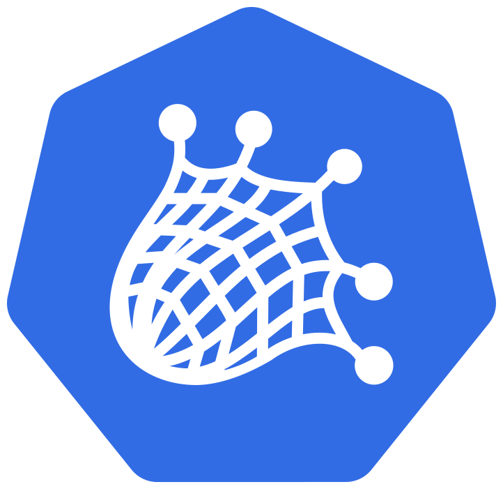
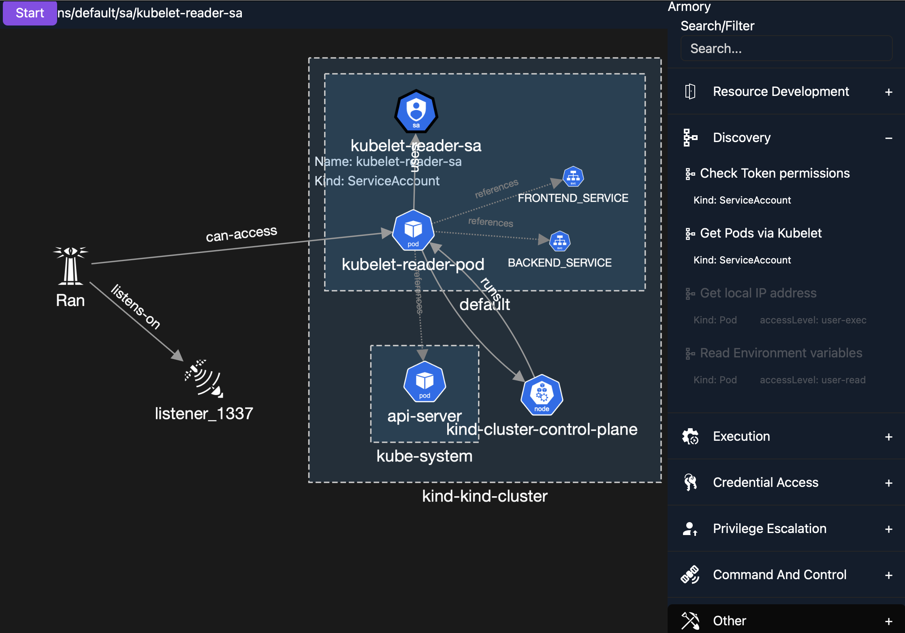

# Ran

Ran is an experimental offensive tool for Kubernetes clusters. It has two main objectives:
- enable quick (realistic) emulation of adversary techniques with predefined actions
- a collection for known attack vectors in Kubernetes (i.e. the implementation of the aforementioned actions)

The name is inspired by Rán, the Norse goddess of the sea (meaning 'plundering', 'theft' or 'robbery' in old Norse), who is associated with sea storms and drowned death.
She is symbolized by a net, which she uses to ensnare and pull the unwary into the depths of the ocean.

❗ This tool is only intended for educational/demonstration purposes! Any other usage is highly discouraged.

> ** ⚠️ Warning: This project is very early stage and highly experimental. Use at your own risk.**

## Motivation

In security, the cliche of the "attacker's advantage" is often cited: 
> an attacker has to be right once, but a defender has to be right all the time

This statement may be true for the `initial access` (IA) of an attack, but the script flips after the IA: defenders (theoretically) have full knowledge/visibility of the environment, while an attacker has to explore and learn about the environment first.
This asymmetry is a huge advantage for the defender, which is often overlooked.
The focus on just [atomic detections](https://medium.com/mitre-engenuity/ahhh-this-emulation-is-just-right-introducing-micro-emulation-plans-7bf4c26451d3) of TTPs amplifies this misconception.
Instead, when using at least micro emulations, where an adversary has to explore the environment, the [defenders have more tools at their disposal](https://d3fend.mitre.org).

---

### For Defenders

Creating detections for environments is always very challenging. Maintaing these over time even more so. By viewing an environment through the lens of an adversary, different gaps or opportinities may arise.
Using Ran, practicioners can explore the threats on their own environments and record all steps.
Ran can export these tracked attacker steps into an [AttackFlow](https://ctid.mitre.org/projects/attack-flow), which is based on STIX 2. Some of the captured steps have observables linked, which can inform the managed detection rules.

## Architecture

Ran consists of 2 major components:
- C2: a classic command & control component executing given actions and manages implants, etc.
- Planner: component deliberating what actions to execute and in what order. Maturity levels:
    1) No planner: a human operator 
    2) Imperative Plan: pre-defined plan, that will be executed (i.e. a runbook)
    4) Deterministic AI: 
        - Behavior Trees
        - Classical planning
        - Hierarchical Task Network (HTN)
        - Goal-Oriented Action Planning (GOAP)
    5) Probabilistic AI
        - (RL, LLM, Active Inference)

This approach is [📄 Automated Adversary Emulation: A Case for Planning and Acting with Unknowns](https://www.mitre.org/sites/default/files/2021-11/prs-18-0944-1-automated-adversary-emulation-planning-acting.pdf)

## Setup

- Install Sliver
    - generate a operator configuration, so Ran can act as a client

## Similar Projects

Ran is heavily inspired by similar tools in this domain, such as:
- [Caldera](https://github.com/mitre/caldera)
- [Peirates](https://github.com/inguardians/peirates)
- [Kubesploit](https://github.com/cyberark/kubesploit)
- [kube-hunter](https://github.com/aquasecurity/kube-hunter)
- [kdigger](https://github.com/quarkslab/kdigger)
- [MKAT](https://github.com/DataDog/managed-kubernetes-auditing-toolkit/)
- [kubeletmein](https://github.com/4ARMED/kubeletmein)
- [CDK - Zero Dependency Container Penetration Toolkit](https://github.com/cdk-team/CDK/)
- [red-kube](https://github.com/lightspin-tech/red-kube)
- [kubestroyer](https://github.com/Rolix44/Kubestroyer)
- [Leonidas](https://github.com/WithSecureLabs/leonidas)
- [IceKube](https://github.com/WithSecureLabs/IceKube)

#### Tools for potential support
- https://github.com/vulsio/go-exploitdb
- [PEASS-ng](https://github.com/peass-ng/PEASS-ng)
- [go-pillage-registries](https://github.com/nccgroup/go-pillage-registries)
- [amicontained](https://github.com/genuinetools/amicontained)
- [dopwn](https://github.com/4ARMED/dopwn)
- [botb](https://github.com/brompwnie/botb)
- [MTKPI](https://github.com/r0binak/MTKPI) Multi Tool Kubernetes Pentest Image 
- [Dredge](https://github.com/grahamhelton/dredge)
- [deepce](https://github.com/stealthcopter/deepce)

## Armory

### Container Escape
- https://github.com/danielsagi/kube-pod-escape

- https://github.com/aws-samples/hardeneks

### Defense Evasion
- https://github.com/m0nad/Diamorphine/tree/master

## LolBINS
- [GTFOBins](https://gtfobins.github.io): list of Unix binaries that can be used to bypass local security restrictions in misconfigured systems
- [LOTTunnels](https://lottunnels.github.io): Living Off The Land Tunnels
- [LOLC2](https://lolc2.github.io/)
- [LOLRMM](https://lolrmm.io/)

## Roadmap:

- [x] Track the executed TTPs (audit trail)
- [x] Export trail of executed TTP as [Attack Flow](https://center-for-threat-informed-defense.github.io/attack-flow/)
- [ ] option to provide [Attack Flow](https://center-for-threat-informed-defense.github.io/attack-flow/) as a plan
- [ ] [MCP](https://www.anthropic.com/news/model-context-protocol) support for "Vibe kiddies" 🤖
- [ ] Derive produced observable from the TTP execution and link it in the Attack Flow
- [ ] Support hierarchical TTPs: they use other TTPs as building blocks (akin to HTN)
    - e.g., `Install implant` could be -> `generate implant` + `download binary` + `execute binary`
- [ ] create API server for the execution layer

## References

[Raesene KubeSecurity Lab](https://github.com/raesene/kube_security_lab/tree/main)
BishopFox's [BadPods](https://bishopfox.com/blog/kubernetes-pod-privilege-escalation)

## Tool comparison
For a comparison with other tools refer to the [comparison](docs/tool_comparison.md)
