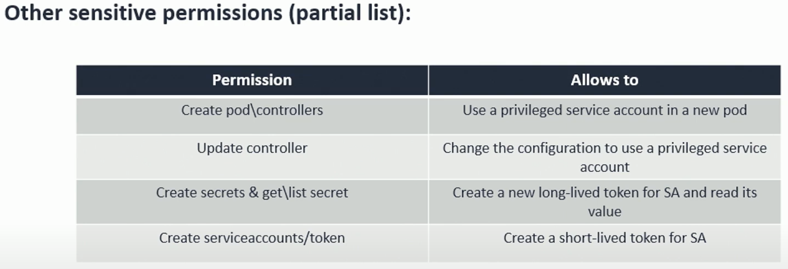

## Initial Access
- Wiz [Making Sense of Kubernetes Initial Access Vectors Part 1 – Control Plane](https://www.wiz.io/blog/making-sense-of-kubernetes-initial-access-vectors-part-1-control-plane)
- Wiz [Making Sense of Kubernetes Initial Access Vectors Part 2 - Data Plane](https://www.wiz.io/blog/kubernetes-data-plane)

## Privilege Escalation
- SentinelOne [Climbing The Ladder | Kubernetes Privilege Escalation (Part 1)](https://www.sentinelone.com/blog/climbing-the-ladder-kubernetes-privilege-escalation-part-1)  
- SentinelOne [Climbing The Ladder | Kubernetes Privilege Escalation (Part 2)](https://www.sentinelone.com/blog/climbing-the-ladder-kubernetes-privilege-escalation-part-2/)

- [CVE-2024-45310](https://github.com/advisories/GHSA-jfvp-7x6p-h2pv)
	- from talk ["containers / security / a fun time -- pick two" - Aleksa (purplecon 2024)](https://www.youtube.com/watch?v=cY4ko-KhDGU)


## Lateral Movement
- Wiz [NamespaceHound](https://github.com/wiz-sec-public/namespacehound)
- given: hostPath mount: put a static pod manifest on the node, which spawns a privileged pod
	- try with invalid namespace name in manifest -> visibile in k8s api?

- Workload that can `update` itself:
	- change to privileged -> escape to host
	- change service account
	- schedule to specific node 
	- ref: https://youtu.be/1rmg2QfLJtY?t=671
	- 


## Cloud Pivot:
-  direct IMDSv1 access
	- Azure: 169.254.169.254/metadata/identity/oauth2
	- AWS: 169.254.169.254/latest/meta-data/iam/security-credentials
	- GCP: metadata.google.internal/computeMetadata/v1/instance/service-accounts
- By default, the EC2 role has the policies:
	- AmazonEC2ContainerRegistryReadOnly - Pull permissions to the container registry.
	- AmazonEKSWorkerNodePolicy - Read permissions to the compute environment (EC2, VPC etc.)
	- AmazonEKS_CNI_Policy - Attach network interfaces and IPs to VMs

- OIDC: https://aws.amazon.com/blogs/containers/introducing-fine-grained-iam-roles-service-accounts/
	- GKE has unified identity pool in the project: https://youtu.be/1rmg2QfLJtY?t=1912
		- security boundary is the project (not the cluster) -> pivot between clusters?


## Discovery

- [K8spider](https://github.com/Esonhugh/k8spider): supports to scan all services installed in Kubernetes cluster and all exposed ports in service

## Interesting tools to try to support


## SSH
- [Dropbear](https://github.com/mkj/dropbear)   #lolbin

## Tunnels
- [bore](https://github.com/ekzhang/bore)  
	- alternative to ngrok


## Invert detection rules

- [Chainguard's OSquery-defense-kit](https://github.com/chainguard-dev/osquery-defense-kit/tree/main)
- [Elastic Deteciton Rules](https://github.com/elastic/detection-rules/tree/main/rules/linux)
- [Falco Rules](https://falcosecurity.github.io/rules/)


## LLM Planner

- useful LLM Action Constraints discussed in CyberLayer scenario in the talk [What Lies Beneath the Surface? Evaluating LLMs for Offensive Cyber Capabilities](https://youtu.be/p9T4gWds54o?t=1898)

---

## Disable Security Controls defined as Label on a Namespace
### Commands

```kubectl
kubectl label --overwrite ns ${NS} pod-security.kubernetes.io/enforce=privileged
```

### References:
[I'll Let Myself In: Kubernetes Privilege Escalation Tactics - Andrew Martin & Ian Smart](https://youtu.be/f10WQlr0h_M?t=953) a user with wildcard permissions in the same Namespace can overwrite security controls defined as labels on a namespace (KubeCon EU '24)

---
## Redirectors

- [Piko](https://github.com/andydunstall/piko?utm_source=tldrnewsletter): open-source alternative to Ngrok, designed to serve production traffic and be simple to host (particularly on Kubernetes)
- [RedGuard](https://github.com/wikiZ/RedGuard): a C2 front flow control tool,Can avoid Blue Teams,AVs,EDRs check.